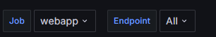
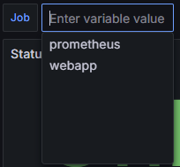
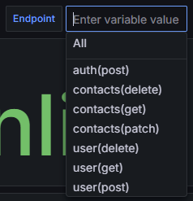
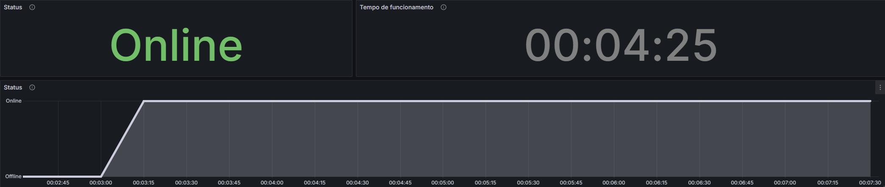
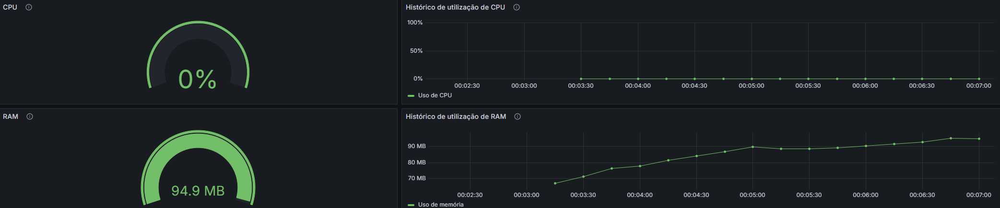
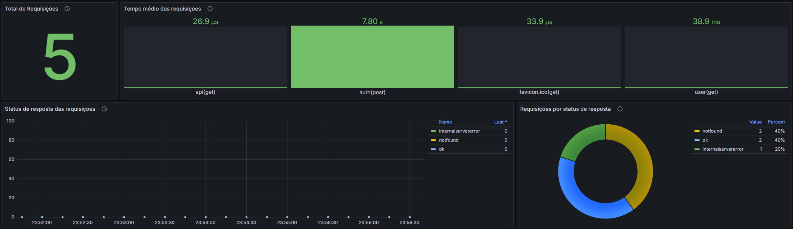
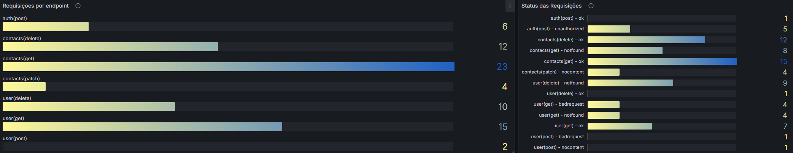

# Monitoramento Contact - Manager API

 O monitoramento da API foi realizado através do Prometheus, responsável por coletar os dados de funcionamento da API e disponibilizá-los para o Grafana, que é a plataforma utilizada para gerar o dashboard de monitoramento, criado com objetivo de apresentar as informações em um formato visual e intuitivo, facilitando o processo de monitoria da aplicação

| | |
| -- | -- |
| **Desenvolvido em** | Grafana - v11.2.0^ |
| **Fonte de dados** | Prometheus - v2.53.2^ |
| **Conector Prometheus** | prometheus-net.AspNetCore - v8.2.1^ |

# Dashboard

## Variáveis

Para realizar a filtragem dos gráficos e possibilitar a alteração da API monitorada, foram criados filtros em forma de variáveis no dashboard

### Job
Filtro da aplicação a ser monitorada

|  |  |
| -- | -- |
| **Variable name** | $job |
| **Query type** | Label values |
| **Label** | job |
| **Metric** | up |
| **Label filters** | - |

### Endpoint
Filtro do endpoint a ser monitorado

|  |  |
| -- | -- |
| **Variable name** | $request_path |
| **Query type** | Label values |
| **Label** | path |
| **Metric** | http_requests_info_total_count |
| **Label filters** | job = $job |

## Monitoramento do status da aplicação

Para monitorar o status de funcionamento da aplicação, foram disponibilizados alguns gráficos para analisar tanto o histórico quanto a informação em near-real-time

### Status(Online/Offline)
Status do serviço monitorado

|  |  |
| -- | -- |
| **Query(promql)** | up{job="$job"} |
| **Value mapping** | 1 = Online(verde); 0 = Offline(vermelho) |
| **Threshold** | - |

### Tempo de funcionamento
Último tempo de funcionamento registrado pela API

|  |  |
| -- | -- |
| **Query(promql)** | time() - process_start_time_seconds{job=~"$job"} |
| **Value mapping** | - |
| **Threshold** | - |

### Status(Timeline)
Histórico do status da API por tempo

|  |  |
| -- | -- |
| **Query(promql)** | up{job="$job"} |
| **Value mapping** | 1 = Online(verde); 0 = Offline(vermelho) |
| **Threshold** | - |

## Monitoramento do consumo de recursos
Para monitoramento do consumo de recursos da máquina pela aplicação, foram criados alguns gráficos

### CPU(Medidor)
Percentual de utilização do CPU pela API

|  |  |
| -- | -- |
| **Query(promql)** | system_runtime_cpu_usage{job="$job"} |
| **Value mapping** | - |
| **Threshold** | base = verde; 80 = amarelo; 90 = vermelho |

### CPU(Timeline)
Histórico de utilização de CPU pela API por tempo

|  |  |
| -- | -- |
| **Query(promql)** | system_runtime_cpu_usage{job="$job"} |
| **Value mapping** | - |
| **Threshold** | base = verde; 80 = amarelo; 90 = vermelho |

### RAM(Medidor)
Uso da memória pela API(em bytes)

|  |  |
| -- | -- |
| **Query(promql)** | process_private_memory_bytes{job="$job"} |
| **Value mapping** | - |
| **Threshold** | base = verde; 1073741824 = amarelo; 2147483648 = vermelho |

### RAM(Timeline)
Histórico de utilização de RAM pela API(em bytes)

|  |  |
| -- | -- |
| **Query(promql)** | process_private_memory_bytes{job="$job"} |
| **Value mapping** | - |
| **Threshold** | base = verde; 1073741824 = amarelo; 2147483648 = vermelho |

## Monitoramento de requisições
Para monitoramento das requisições recebidas pela API, foram criados alguns gráficos para monitorar latência, caminho e status de resposta

### Total de Requisições
Número total de requisições recebidas pela API

|  |  |
| -- | -- |
| **Query(promql)** | sum(http_requests_info_total_count{job=~"$job", path=~"$request_path"}) |
| **Value mapping** | - |
| **Threshold** | base = amarelo; 1 = verde |

### Tempo médio das requisições
Média de tempo(em segundos) que as requisições estão levando na API

|  |  |
| -- | -- |
| **Query(promql)** | sum(http_requests_info_total_sum{job=~"$job", path=~"$request_path"}) by (path)  / sum(http_requests_info_total_count{job=~"$job", path=~"$request_path"}) by (path) |
| **Value mapping** | - |
| **Threshold** | base = verde; 80 = vermelho |

### Status de resposta das requisições
Resumo dos status de resposta da API para as requisições durante o período selecionado

|  |  |
| -- | -- |
| **Query(promql)** | sum by(request_status) (round(increase(http_requests_info_total_count{job=~"$job"}[$__range]))) |
| **Value mapping** | - |
| **Threshold** | - |

### Requisições por endpoint
Número de requisições recebidas por endpoint

|  |  |
| -- | -- |
| **Query(promql)** | sum by(request_status) (round(increase(http_requests_info_total_count{job=~"$job"}[$__range]))) |
| **Value mapping** | - |
| **Threshold** | - |

### Status das Requisições
Resumo dos status de retorno(HttpStatus) retornados pela API

|  |  |
| -- | -- |
| **Query(promql)** | sum(http_requests_info_total_count{job=~"$job", path=~"$request_path"}) by (request_status, path) |
| **Value mapping** | - |
| **Threshold** | - |